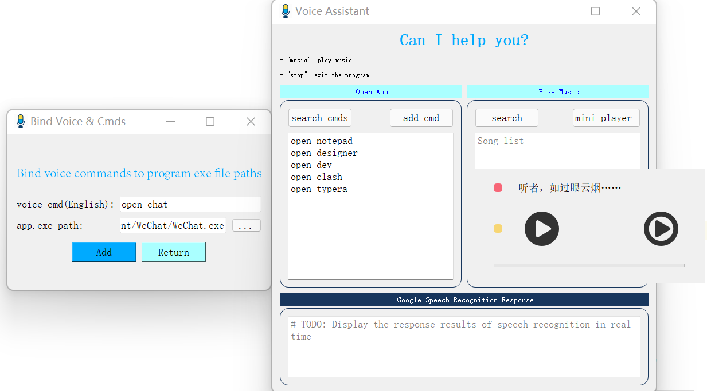
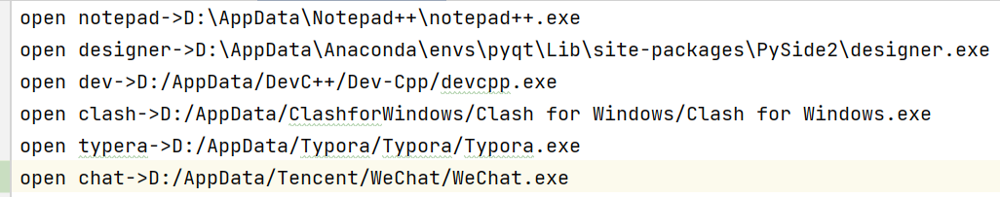
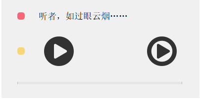

#  Google Speech Recognition Assistant



## Open windows applications
- main view


- bounding cmd to exe


- add


- text file: key->value



- Mini music




## Play music
- don't use proxy
- just say "play music" or "music"
- say "stop" to exit the program
- click "mini player" button

## How to run
- clone
```shell
git clone git@github.com:lif314/asr_speech_recognition.git
```
- pip
```shell
pip install -r requirements.txt 
```
- run
```shell
python main.py
```