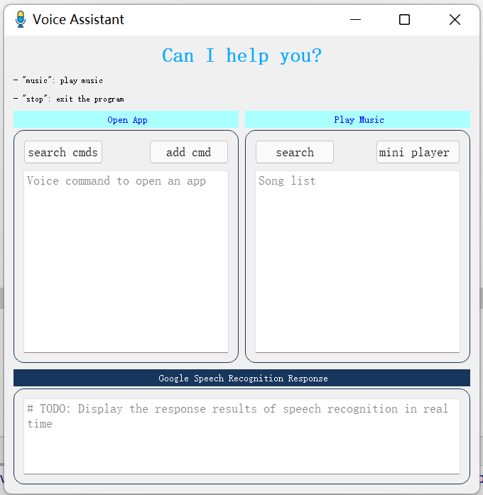

#  Google Speech Recognition Assistant


## Open windows applications
- main view



- bounding cmd to exe


- add


- text file: key->value


- Mini music


## Play music
- don't use proxy
- just say "play music" or "music"
- say "stop" to exit the program
- click "mini player" button

## How to run
- clone
```shell
git clone git@github.com:lif314/asr_speech_recognition.git
```
or
```shell
git clone https://github.com/lif314/asr_speech_recognition.git
```

- pip
```shell
pip install -r requirements.txt 
```
- run
```shell
python main.py
```

## File Structure
```shell
lib                     # 由于PyAudio直接无法下载，这里是.whl文件，可以通过这个进行安装
music                   # 本地音乐文件，只有周杰伦的晴天一首歌曲
note                    # 项目学习一点笔记
textDatabase            # 语音命令和exe存在的文件   
ui                      # Qt Designer设计的界面文件
addView.py              # 添加语音命令和exe文件路径
asr.py                  # 语音识别模块
asrInterface.py         # 作业demo，未使用
background_listening.py # 官方demo, 测试使用
cloudMusic.py           # 网易云爬虫 
cmdAppDatabase.py       # 处理语音命令和exe程序路径的“文件数据库上下文”
executeCmds.py          # 打开应用程序和播放本地音乐
guessTheWord.py         # 作业demo,未使用
main.py                 # 主函数
mainView.py             # 主界面
musicView.py            # 迷你音乐播放器界面
README.md               # 介绍
requirements.txt        # 依赖库 
test.py                 # 测试文件
threaded_workers.py     # 官方demo,测试使用
```