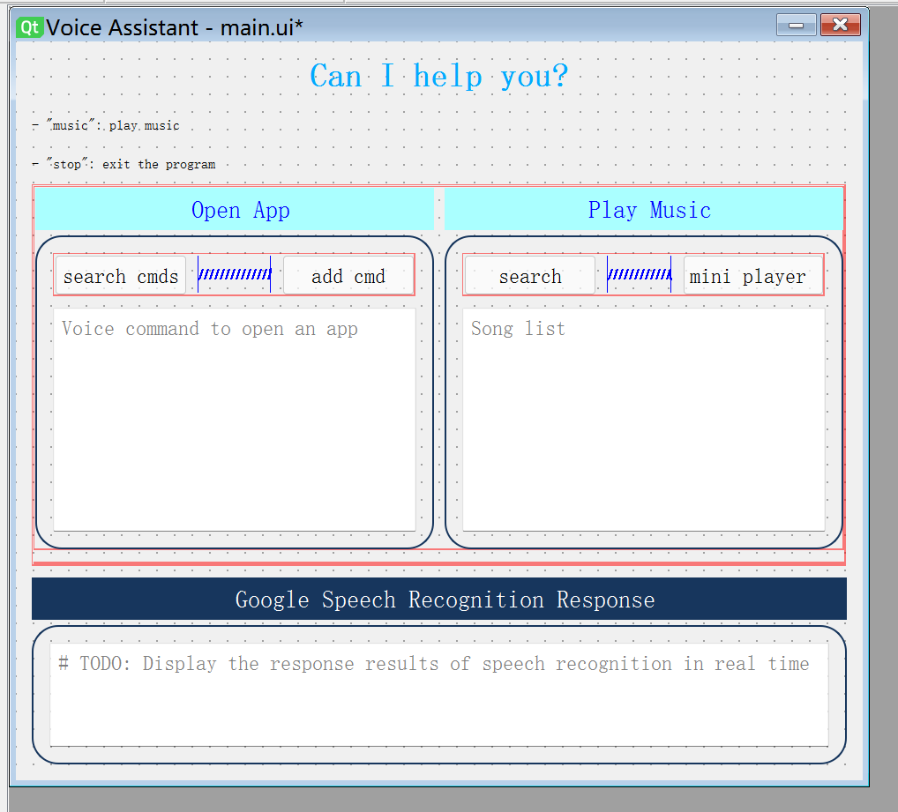
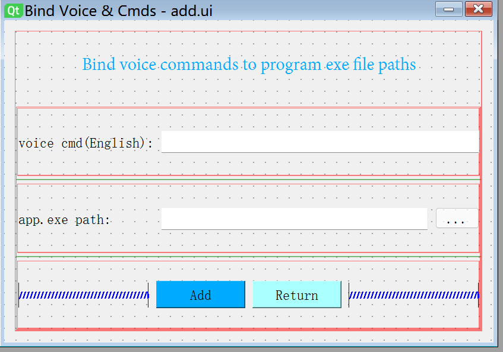
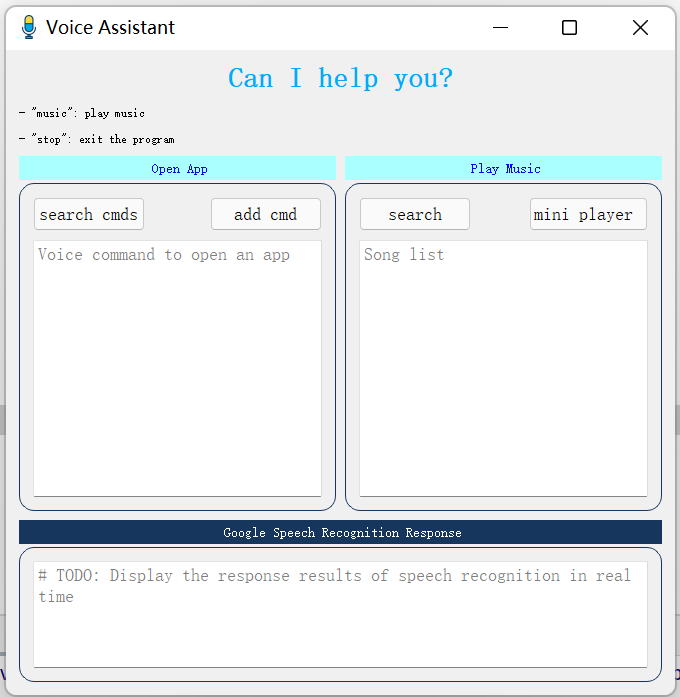
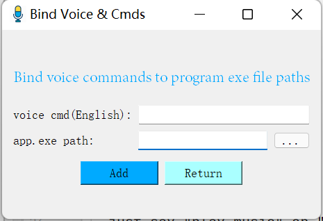
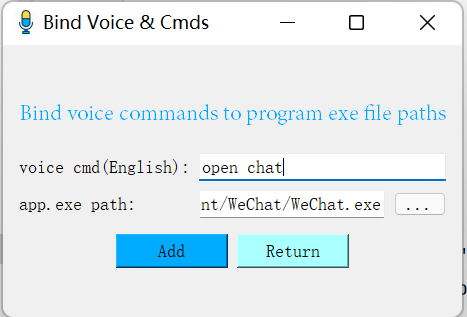
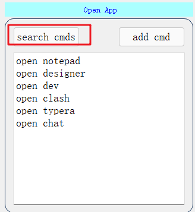
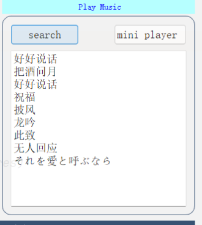
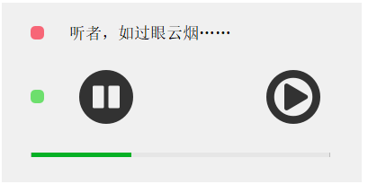

# Voice Assistant

[TOC]

## 1. 界面设计与实现

界面设计使用的是PySide2+Qt Designer实现，PySide2与PyQt5基本一样，大部分函数都是通用的。

### 1.1 使用Qt Designer设计界面样图：

- 主界面




- 添加语音命令与程序exe界面



### 1.2 设计步骤

- Qt Designer可以使用拖拽的方式在界面中添加控件。如Push Button, List View等。
- 为界面元素添加布局，遵循“从小到大”的布局原则，这样可以有序为界面元素添加布局。主要有四种布局方案：Vertical Layout, Horizontal Layout, Grid Layout, Form Layout。在每一个布局内部元素之间，可以使用layoutRowStrwtch分配占比。
- 为界面元素添加“名字”。使用Qt Designer设计的界面文件以`.ui`结尾，可以加载为python中的界面。在python中调用界面元素就是通过这个"名字"。比如：addButton表示添加按钮的名字。
- 保存为`.ui`文件
- 在python中，我们使用以下方式加载界面资源。当然，你也可以将其导出为python代码文件。

```python
self.ui = QUiLoader().load("ui/main.ui")
```

- 按照元素的名字为元素添加绑定事件。

```python
self.ui.searchButton.clicked.connect(self.search_cmds)
self.ui.musicButton.clicked.connect(self.search_music)
```

如`searchButton`表示是一个搜索的按钮，点击可以触发`search_cmds()`事件。

```python
    # 查询打开程序的语音命令列表
    def search_cmds(self):
        dic = get_as_dic()
        keys = dic.keys()
        str = ""
        for key in keys:
            str = str + key + "\n"
        self.ui.cmdTextEdit.setPlainText(str)
```

- 至此，完成整个逻辑功能。当然，也可以直接使用代码设计界面，这样灵活性更高，比如`musicView.py`就是全部使用代码写的界面。

### 1.3 界面展示

**主界面**

主界面主要分为三个部分：

- `Open App`: 使用语音控制打开电脑应用程序【windows版本】
  - `search cmds`按钮：点击查看目前可以用来打开应用程序的语音命令。
  - `add cmd`按钮：点击添加新的语音命令和应用程序exe文件路径的绑定关系。
- `Play Music`：使用语音或者手动控制音乐播放。
  - `search`：点击查询歌单【网易云API】
  - `mini player`：点击打开手工播放的mini音乐播放器
- `Google Speech Recognition Response`：实时查看Google语音识别的响应结果【待完善】。




**添加绑定关系界面**

- `voice cmd`：语音命令，通过该命令打开对应的应用程序
- `app.exe path`：应用程序的exe文件路径，点击`...`打开本地文件夹进行选择。



举例：下面展示了使用"open chat"的语音打开微信应用程序




**mini音乐播放器—手动线上音乐播放器**

- "红点"：点击红点退出播放器
- 点击左边按钮播放音乐，点击右边按钮播放下一首音乐。
- 进度条显示音乐播放的进度。


**语音播放本地音乐**

使用语音命令“music”或者“play music”可以播放本地music文件夹下的音乐。

## 2. 功能设计与实现

### 2.1 语音控制

**选择API接口**

- 调用Google的`speech_recognition`库进行实现。该库提供多种调用方式：
  - `Sphinx`可以进行离线识别，但精度极其低，基本不能满足需求。
  - `Google Speech Recognition`: 可以在线调用Google Cloud的语音识别API，精度还不错。【需要可以使用Google才能使用】。
  - 其它几种方式需要进行账号认证、绑定国外银行卡等才能免费试用，不做考虑。

-  综上，我使用`Google Speech Recognition`进行语音识别。

**代码逻辑** 详见`asr.py`

- 导入库

```python
import speech_recognition as sr
```

- 使用PyAudio从麦克风获取

```python
    # obtain audio from the microphone
    def getAudio(self):
        r = sr.Recognizer()
        with sr.Microphone() as source:
            print("Say something!")
            r.adjust_for_ambient_noise(source)  # we only need to calibrate once, before we start listening
            return r, r.listen(source)
```

- 语音识别：返回识别出来的文本信息

```python
    # recognize speech using Google Speech Recognition
    # 这个效果不错，只是延迟比较严重
    def recognizeByGoogle(self):
        r, audio = self.getAudio()
        try:
            res = r.recognize_google(audio)
            return res
        except sr.UnknownValueError:
            return "Google Speech Recognition could not understand audio"
        except sr.RequestError as e:
            return "Could not request results from Google Speech Recognition service; {0}".format(e)
```

- 调用：为防止主线程阻塞，语音识别模板在子线程中持续监听 —`main.py`。

```python
    # 语音监听
    thread = Thread(target=asr.recognizeByGoogle)
    thread.start()
```

### 2.2 多线程设计

由于程序中需要多个功能同时运行，比如持续语音监听、打开应用程序、播放音乐等。如果按照顺序运行，则会导致线程阻塞，界面崩溃【www】。因此需要采用多线程来解决该问题【我没有多线程编程经验，仍存在很多问题会在TODO模块中详述】

- 主线程中是程序基本逻辑，其它功能每次运行都单独开启在一个线程中运行。

- 整体逻辑：

  - 主线程是语音监听逻辑处理逻辑。

    - 界面在独立的线程中运行

      ```python
      view_thread = Thread(target=start_view)
      ```

    - 界面中的点击实现也在独立线程中运行

    ```python
    	# 查询音乐播放列表
        def search_music(self):
            def threadFunc():
                musicApi = NeteaseCloudMusicApi()
                songs = musicApi.get_new_songs_details()
                names = ""
                for song in songs:
                    names = names + song['name'] + "\n"
                self.ui.musicTextEdit.setPlainText(names)
            music_thread = Thread(target=threadFunc)
            music_thread.start()
    ```

  - 语音监听后处理操作都在单独的线程中运行，以此保证语音监听不会阻塞

    - 播放音乐

      ```python
      # 新建一个线程进行处理
      music_thread = Thread(target=cmdExecutor.play_music)
      music_thread.start()
      ```

    - 打开应用程序

    ```python
    open_thread = Thread(target=cmdExecutor.open_app(dic.get(cmd)))
    open_thread.start()
    ```

- 主逻辑代码片段：

```python
    # 界面线程
    view_thread = Thread(target=start_view)
    # 语音监听线程
    thread = Thread(target=asr.recognizeByGoogle)
    try:
        view_thread.start()
    except:
        print("界面处理失败!")

    # 获取app cmds
    dic = get_as_dic()
    cmds = dic.keys()
    # 命令执行器
    cmdExecutor = ExecuteCmds()
    while True:
        res = asr.recognizeByGoogle()
        # TODO 实时显语音识别响应结果 respTextEdit
        # view.mainView.ui.respTextEdit.setPlainText("识别结果：" + res)
        print("识别结果：", res)
        res = res.lower()
        if res.find("stop") >= 0:
            os._exit(0)
            # sys.exit(1)
        elif res.find("music") >= 0:
            # 新建一个线程进行处理
            music_thread = Thread(target=cmdExecutor.play_music)
            music_thread.start()
            continue
            # cmdExecutor.play_music()
        elif res in cmds:
            for cmd in cmds:
                if(res == cmd):
                    open_thread = Thread(target=cmdExecutor.open_app(dic.get(cmd)))
                    open_thread.start()
                    break
        else:
            continue
```

### 2.2 打开本地应用程序

- 使用os模块打开windows应用程序

```python
    # 打开应用程序
    def open_app(self, app_dir):
        os.startfile(app_dir) # app_dir:应用程序的.exe文件路径
```

- 为了提高应用的实用性，我将语音命令和exe路径以键值对的形式存在在本地文件中

```shell
open typera->D:/AppData/Typora/Typora/Typora.exe
open chat->D:/AppData/Tencent/WeChat/WeChat.exe
```

- 语音识别的返回结果中只要是打开程序的语音的命令，就会打开本地应用程序

```python
	# 获取app cmds
    dic = get_as_dic()
    cmds = dic.keys()
    # 命令执行器
    cmdExecutor = ExecuteCmds()
    while True:
        res = asr.recognizeByGoogle()
        # TODO 实时显语音识别响应结果 respTextEdit
        # view.mainView.ui.respTextEdit.setPlainText("识别结果：" + res)
        print("识别结果：", res)
        res = res.lower()
        if res.find("stop") >= 0:
            os._exit(0)
        elif res in cmds:
            for cmd in cmds:
                if(res == cmd):
                    open_thread = Thread(target=cmdExecutor.open_app(dic.get(cmd)))
                    open_thread.start()
                    break
        else:
            continue
```

- 在主界面，我添加了一个`search cmds`按钮可以查询当前文件中所存储的语音命令



```python
# 获取命令数据
def get_as_dic() -> dict:
    # cmd_apppath 键值对
    dic = {}
    fr = open(r'./textDatabase/cmd_app.text', 'r', encoding='UTF-8')
    for line in fr:
        value = line.strip().split('->')
        dic[value[0]] = value[1]
    fr.close()
    return dic
```

- 也添加了一个动态添加语音命令和exe文件路径的按钮`add cmd`，点击打开addView，可以添加命令


```python
# 添加数据
def add_to_file(cmd, path):
    print(cmd, path)
    if cmd is '' or path is '':
        print("路径选择为空！")
    else:
        f = open(r'./textDatabase/cmd_app.text', 'a', encoding='UTF-8')
        f.write(cmd + '->' + path + '\n')
        f.close()
```

### 2.3 播放音乐

音乐播放主要有两种：本地音乐播放和线上音乐播放。本地实现比较简单；线上音乐播放由于多线程问题目前还不能支持语音控制。

#### **本地音乐播放**

- 语音识别到"music"会播放本地音乐

```python
   while True:
        res = asr.recognizeByGoogle()
        res = res.lower()
        if res.find("stop") >= 0:
            os._exit(0)
            # sys.exit(1)
        elif res.find("music") >= 0:
            # 新建一个线程进行处理
            music_thread = Thread(target=cmdExecutor.play_music)
            music_thread.start()
            continue
        else:
            continue
```

- 使用"playsound"模块进行音乐播放

```python
    # 播放音乐
    def play_music(self):
        playsound("./music/qingtian.mp3")
```

#### **线上音乐音乐播放**

线上音乐播放是通过爬虫获取【[网易云API](https://neteasecloudmusicapi.vercel.app)】中的音乐，然后通过mp3的url进行播放。遗憾的是，在浏览器中，我们可以通过mp3的url链接直接播放音乐，在python3中却不可以，通过查询资料发现这种音频转换是一件很复杂的事情。于是只能暂时搁置。

- **夭折的python mp3播放**

前期为了显示爬虫的音乐列表，界面中在Play Music模块中添加了`search`按钮，通过该按钮可以获取爬虫到的10首歌曲的名字。



在`cloudMusic.pyy`中展示了使用`urllib`模块进行简单爬虫。

```python
"""
    功能：使用歌单详情接口后 , 能得到的音乐的 id, 但不能得到的音乐 url, 调用此接口, 传入的音乐 id( 可多个 , 用逗号隔开 ), 
        可以获取对应的音乐的 url,未登录状态或者非会员返回试听片段(返回字段包含被截取的正常歌曲的开始时间和结束时间)
    必选参数 : id : 音乐 id
    可选参数 : br: 码率,默认设置了 999000 即最大码率,如果要 320k 则可设置为 320000,其他类推
    接口地址 : /song/url
    调用例子 : /song/url?id=33894312 /song/url?id=405998841,33894312
    """
    def get_song_url(self):
        # int list to string: map
        list_string = map(str, self.ten_song_ids)
        ids = ','.join(list_string)
        r = urlopen(self.baseUrl + "/song/url?id=" + ids)
        bytes_data = r.read()
        str_data = str(bytes_data, 'utf-8')
        json_data = json.loads(str_data)
        list_data = json_data.get("data")
        for song in list_data:
            self.ten_song_urls.append({"id":song.get("id"), "url" : song.get('url')})
        # print(json_data)
```

- **使用PySide2的手动迷你播放器**

在PySide2中提供了`QMediaPlayer`进行音乐的播放，可以直接通过mp3的url播放音乐。这个在Qt Designer中无法直接操作，所以自己手写了一个简单的音乐播放器，MP3也是在爬虫获取的随机歌曲信息。

你可以在主界面中通过`mini player`打开音乐播放器。



- 异步子线程获取音乐链接

```python
class GetMusicThread(QtCore.QThread):
    finished_signal = QtCore.Signal(str)
    # finished_signal = QtCore.Signal(str) # PySide2的使用方法

    def __init__(self,parent=None):
        super().__init__(parent)

    def run(self):
        reps = requests.post("https://api.uomg.com/api/rand.music?format=json")
        # print(reps.json())
        currentSong = reps.json()['data']
        file_url = currentSong['url']
        self.finished_signal.emit(file_url)
```

- 使用QMediaPlayer播放音乐。

```python
   # 设置播放器
    def init_player(self,url):
        # print("获取到音乐链接：",url)
        content = QMediaContent(QtCore.QUrl(url))
        self.player.setMedia(content)
        self.player.setVolume(50)
        self.player.play()
        self.duration = self.player.duration()  # 音乐的时长
        # 设置状态为绿色
        self.status_label.setStyleSheet('''
            QLabel{
                background:#6DDF6D;
                border-radius:5px;
                }
        ''')
```

 但目前它还不能与语音识别进行联动，原因主要是两个：

- 一个是线程之中如何让传递参数的。为了防止界面崩溃，我把界面单独运行在一个线程中，主线程中是语音识别处理逻辑，但mp3的url播放是在界面中进行的，我目前该还不清除如何向线程中传递参数去改变它的状态。
- Qt Designer设计的界面与`.py`界面之间如何进行联调，虽然可以将`.ui`转换为`.py·文件，但看着大量的界面代码就感觉不够清奇，所以不想这样做。由于ddl时间，之后慢慢解决。

### 2.4 TODO

- 优化界面，虽然简洁风很符合我的审美，但使用Qt Designer设计的的确没有使用代码一点一点调的好看。不过确实省了好多时间。
- 优化语音识别。目前语音识别主要问题是延迟严重，主要是因为调用的云端的Google Speech Recognition的接口。如果不能访问Google,也不能使用。`CMU Sphinx`支持连线模式，但识别效果很不好，需要进行==预训练==。官方给出了训练的方法，但比较耗费计算资源以及需要进行自己的语音采样，比较麻烦。目前的语音识别也主要是通过大数据来提高精度，其它方案几乎已经黔驴技穷了。
- 解决音乐播放中的线程通信问题。因为是刚学习的使用线程来防止阻塞，所以不是很熟练。之后会进行改进。
  - 一个是线程之中如何让传递参数的。为了防止界面崩溃，我把界面单独运行在一个线程中，主线程中是语音识别处理逻辑，但mp3的url播放是在界面中进行的，我目前该还不清除如何向线程中传递参数去改变它的状态。
  - Qt Designer设计的界面与`.py`界面之间如何进行联调。我把每个页面也放在独立线程中了，怎么交互界面之间的信息需要进一步研究。

## 3. How to run

- clone

```shell
git clone git@github.com:lif314/asr_speech_recognition.git
```

or

```shell
git clone https://github.com/lif314/asr_speech_recognition.git
```

- pip requirements

```shell
pip install -r requirements.txt 
```

- run main()

```shell
python main.py
```

你也可以单独运行其它文件查看每个模块的运行情况。

- 文件结构

```shell
lib                     # 由于PyAudio直接无法下载，这里是.whl文件，可以通过这个进行安装
music                   # 本地音乐文件，只有周杰伦的晴天一首歌曲
note                    # 项目学习一点笔记
textDatabase            # 语音命令和exe存在的文件   
ui                      # Qt Designer设计的界面文件
addView.py              # 添加语音命令和exe文件路径
asr.py                  # 语音识别模块
asrInterface.py         # 作业demo，未使用
background_listening.py # 官方demo, 测试使用
cloudMusic.py           # 网易云爬虫 
cmdAppDatabase.py       # 处理语音命令和exe程序路径的“文件数据库上下文”
executeCmds.py          # 打开应用程序和播放本地音乐
guessTheWord.py         # 作业demo,未使用
main.py                 # 主函数
mainView.py             # 主界面
musicView.py            # 迷你音乐播放器界面
README.md               # 介绍
requirements.txt        # 依赖库 
test.py                 # 测试文件
threaded_workers.py     # 官方demo,测试使用
```

